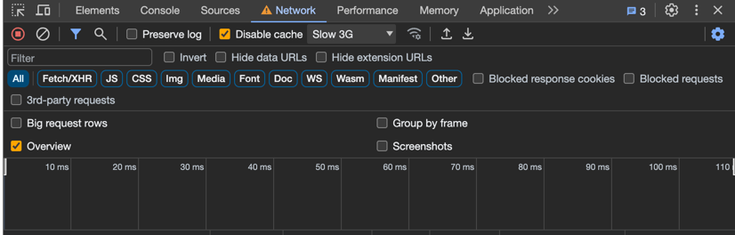

# React Todo App with React-Query and Optimistic Updates 

This is a simple todo app built with React, React-Query using optimistic updates.

<h2 style="color:#e8ba35"> Optimistic Updates </h2>
Idea was to make the app as responsive as possible even in the low network connections.
So, I used optimistic updates to make the app feel more responsive. I would not have implemented this with optimistic 
updates if this was not for the sake of learning since it complicates the code a bit and was overkill given the 
fast network connection speeds that the vast majority enjoys these days. While trying to test the app please set your 
chrome to slow 3g connection to experience the optimistic updates.



<h3 style="color:#e8ba35"> How to run the app </h3>
Make sure you insall the dependencies first

```bash
yarn install
```
make sure your .env file is set up correctly, by default it is set up to use the api hosted at http://api.aydinmustafa.com:3100
<h4> Run the application</h4>

In development mode
```bash
yarn start
```
In production mode
```
yarn build && yarn serve
```